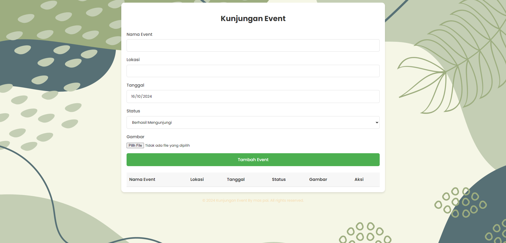

# Aplikasi Kunjungan Event

Aplikasi untuk mencatat kunjungan event.


## Fitur

- Tambah event baru
- Lihat daftar event
- Edit event
- Hapus event

## Teknologi

- PHP
- SQLite
- HTML/CSS

## Penggunaan

1. Isi form untuk menambah event
2. Lihat daftar event di tabel
3. Gunakan tombol Edit atau Hapus untuk mengelola event

## Struktur Database

```sql
CREATE TABLE IF NOT EXISTS event_kunjungan (
    id INTEGER PRIMARY KEY AUTOINCREMENT,
    nama_event TEXT NOT NULL,
    lokasi TEXT NOT NULL,
    tanggal DATE NOT NULL,
    status TEXT NOT NULL,
    gambar TEXT
)